# Getting Started

Welcome to Binary Ninja Sidekick. This document will get you up and running and show you the main features of the Sidekick plugin. For more detailed information, check out the [User's Guide](guide/guide.md).

## Purchase a Sidekick Plan

Most features of the Sidekick plugin are powered by the Sidekick service, which requires an active plan to access. Click [here](https://sidekick.binary.ninja/plans) to purchase a plan that best fits your needs.

!!! note

    When purchasing a plan, you will need to sign in to your Sidekick account. If you do not have a Sidekick account, you will be prompted to create one, or you can create one [here](https://sidekick.binary.ninja/sign_in).

## Sidekick Plugin Installation

The installation process is straightforward and takes only a few minutes.  You can install the Sidekick plugin using the Plugin Manager.

!!! note

    Binary Ninja will install the plugin in the Python environment that is configured in the `Settings` tab.
    If you have not configured a Python environment, the plugin will be installed in the Python packaged with Binary Ninja. The plugin has been
    well tested using the Python packaged with Binary Ninja. Support for other Python versions has not been extensively tested.
    For instructions on configuring Binary Ninja to use a Python virtual environment see [Setting Up a Virtual Environment](environment.md).

### Installing the Plugin

Installing the Sidekick plugin is easy.  Launch the Plugin Manager by selecting `Plugins->Manage Plugins` from the main menu. From the Plugin Manager search for "Sidekick" and locate the Sidekick plugin.  Then click the `Install` button.

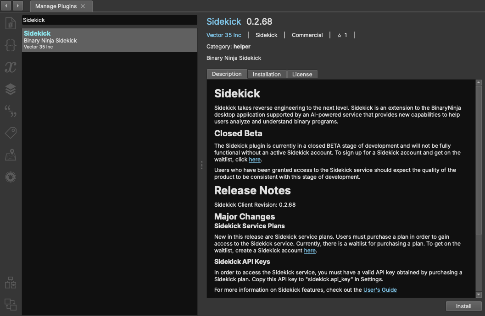

!!! note

    The Sidekick plugin has several package dependencies that may take a few minutes to install. Restart Binary Ninja after installation of the plugin is complete.

### Configuring the Plugin

#### Set the API Key

To set your Sidekick API Key:

* Open the Settings tab within Binary Ninja from the `Binary Ninja->Preferences->Settings` menu
* Search for `sidekick.api_key`
* Copy one of your API keys from your Sidekick account to the `Sidekick API Key` setting

!!! note
    You can find the API keys in your Sidekick account [here](https://sidekick.binary.ninja/account#api-keys)

Alternatively, the first time you launch the Sidekick plugin, you will be prompted to enter your Sidekick API key. If you provide an API key at this point, then it will get saved to your Settings.

## Quick Start

### Connecting to the Sidekick Service

The plugin will connect to the Sidekick service using the API key value in the `sidekick.api_key` setting.  If an API key is not provided, then you will not be able to access the Sidekick service.

!!! note
    All Sidekick features that do not rely on access to the Sidekick service are available to use for free. Refer [here](guide/guide.md#sidekick-service) for more information on which features require access to the Sidekick service.

### Sidekick Service Mode

You can configure the service mode of the Sidekick plugin to online/offline, which enables/disables access to the Sidekick service. To switch the Sidekick plugin between offline and online mode, click the slider toggle in the right side of the status bar at the bottom of the Binary Ninja window.

### Basic Usage

#### **Sidekick Indexes Sidebar**

The Sidekick Indexes Sidebar manages a set of indexes for the current binary. Each index contains a list of items in the binary (e.g., functions, instructions, strings, etc.) that are generated by running an indexer script related to a specific topic. Some indexer scripts for common items are included with Sidekick, or you can create your own.

By default, the built-in index of `High-Level Functions` is loaded in the set the indexes for the current binary.  This index generates a list of functions with a high out-degree.

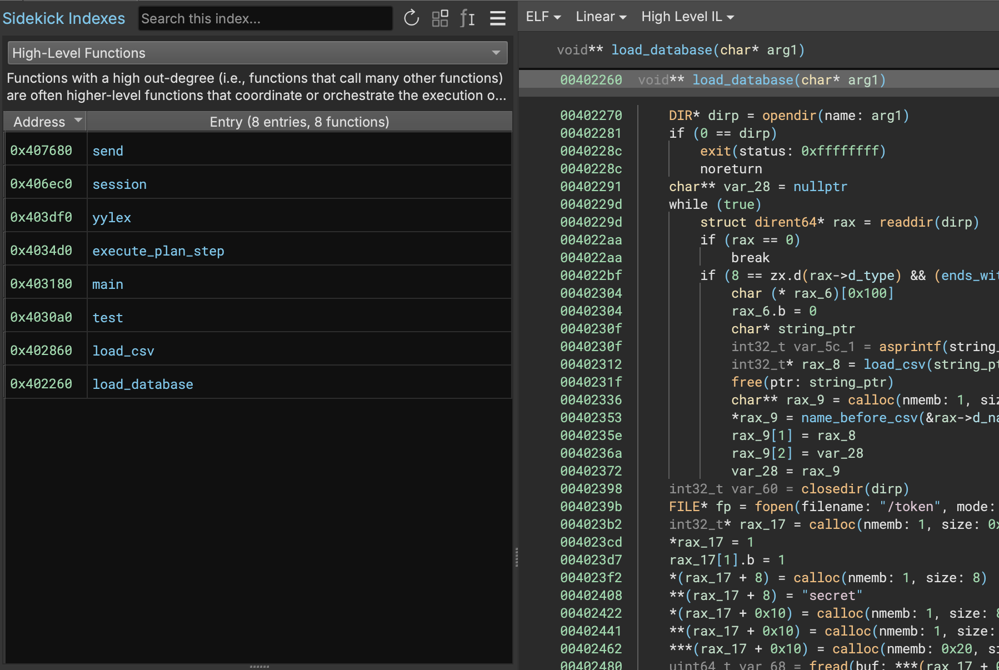

Try adding other indexes to the set of indexes for the current binary

Search from existing indexes by describing the topic you are interested in

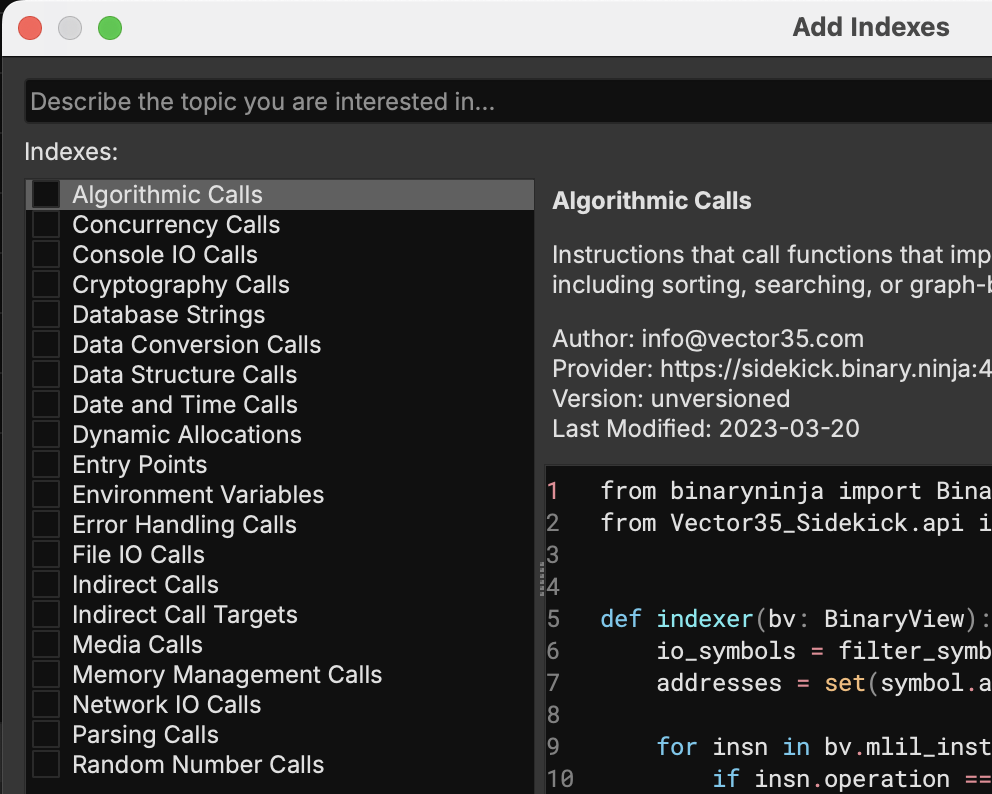

Accept the selected index in order to add it to the index

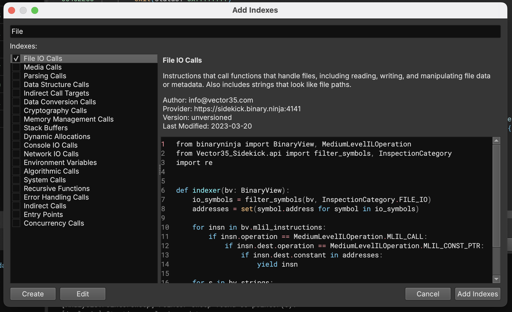

View and navigate to index entries

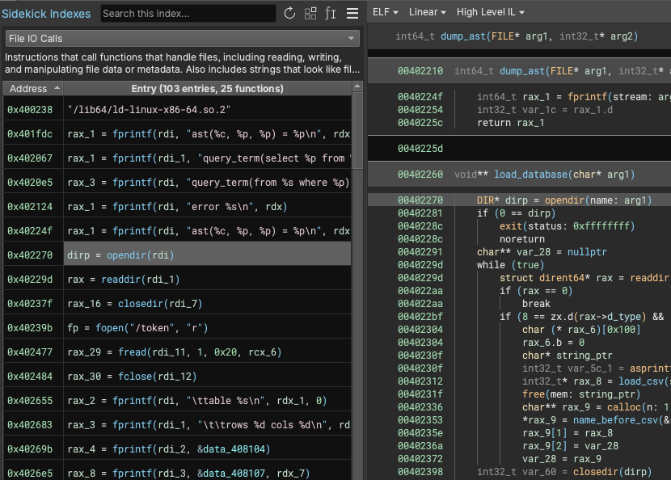

If an index you are interested in does not exist, then create your own by providing a description of what you are looking for and allow Sidekick to generate the indexer script for you

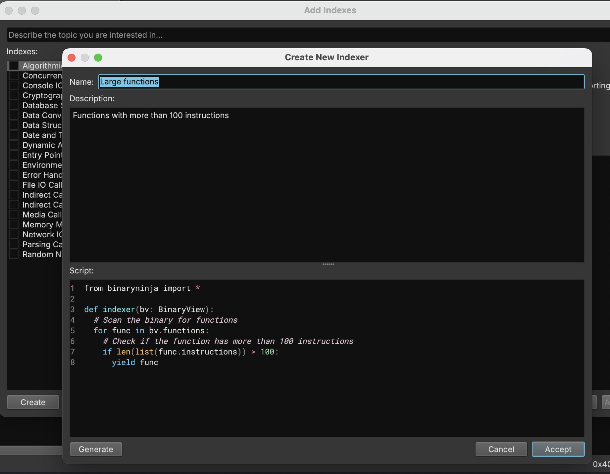

#### **Sidekick Suggestions Reference Sidebar**

Once you have selected a function to investigate, use the `Sidekick Suggestions` reference sidebar to get suggestions for improving the clarity of the current function.

Allow Sidekick to make suggestions for you or choose specific suggestions types yourself

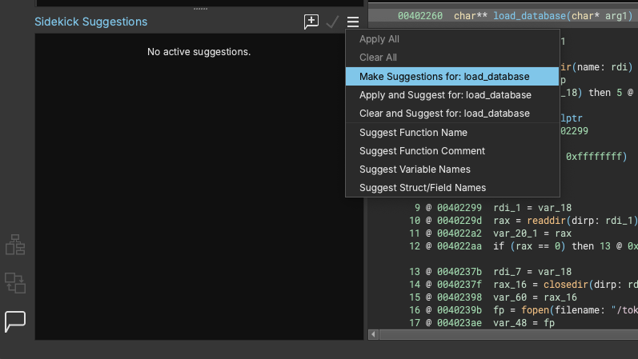

Review suggestions and accept the ones you want to apply

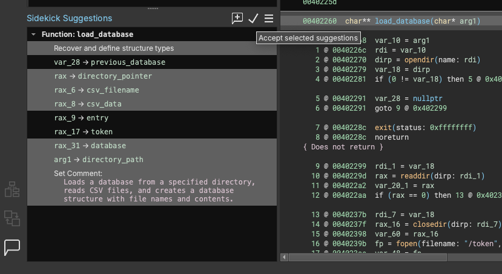

Sit back and watch Sidekick apply them

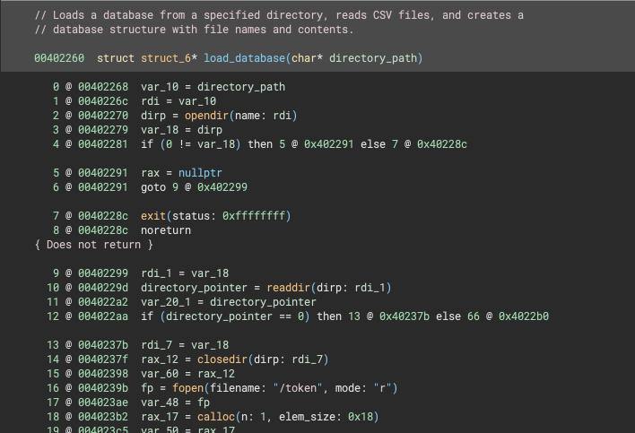

#### **Code Insight Map View**

The `Code Insight Map View` is a call-graph oriented view centered on a selected function and includes items only from the index topics.  This view allows you to quickly visualize the calling relationships between functions and their index topics to aid program comprehension.

Select the Code Insight Map view from the View drop-down menu

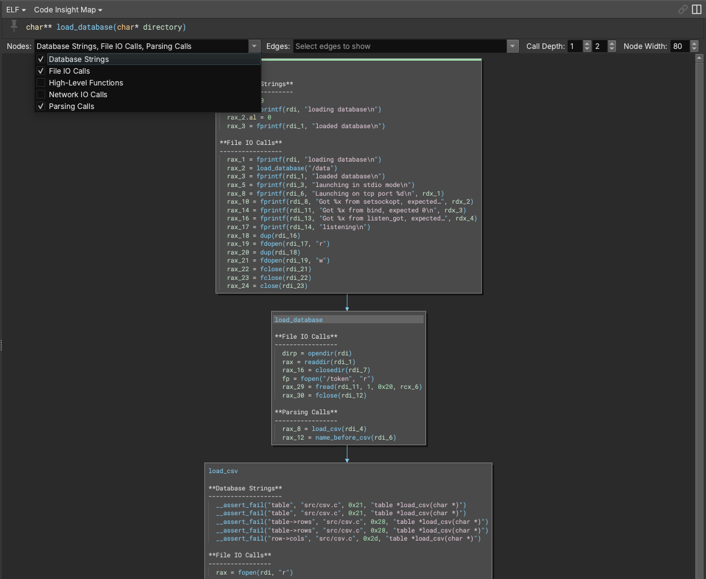

Enable/disable displayed topics

Adjust Call Depth sliders to expand/collapse the call graph context of the given function

#### **Documentation View**

The `Documentation View` provides a description of the current function very much in the style of a traditional man page. Sidekick will automatically generate documentation based on the function code; however, you are able to edit and/or extend this content as you wish.

Select the Documentation View from the View drop-down menu

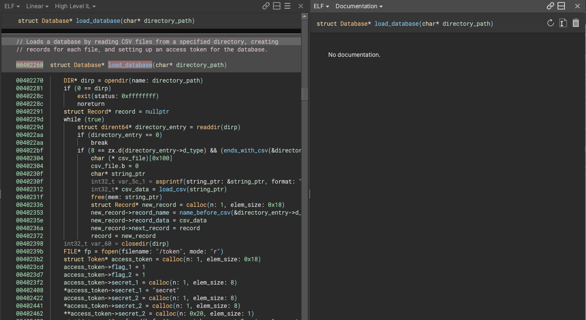

Generate documentation

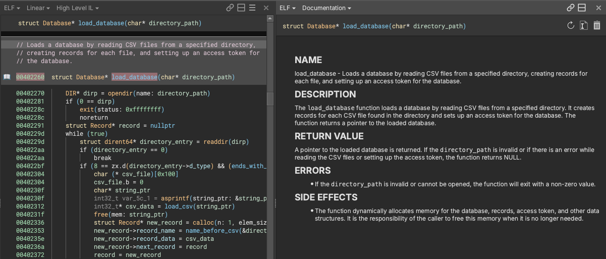

#### **Sidekick Notebook Sidebar**

The Sidekick Notebook Sidebar provides a chat interface to interact with the Sidekick assistant for a given scope of functions. These conversations are stored in the Notebook for easy reference.

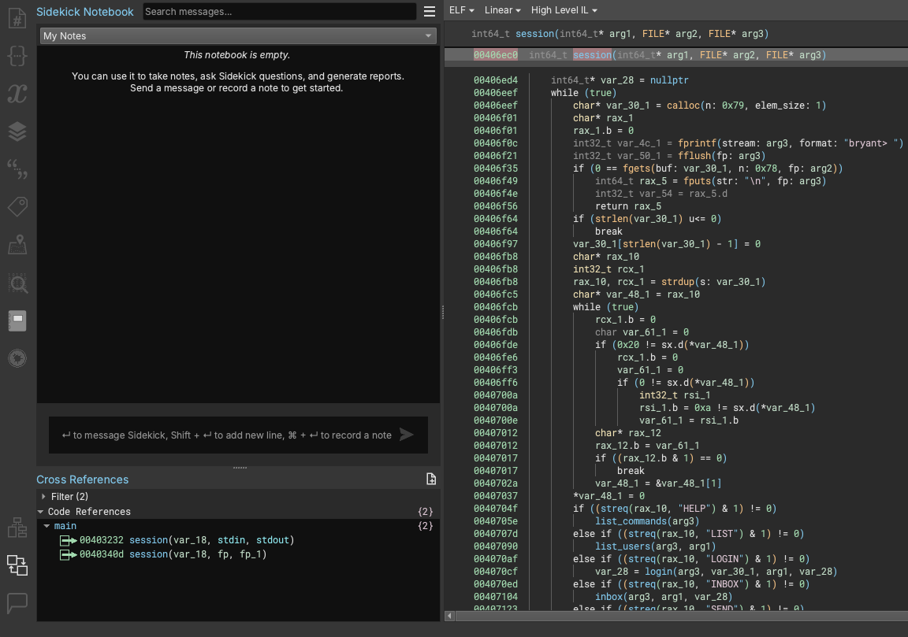

Ask a question about the current function

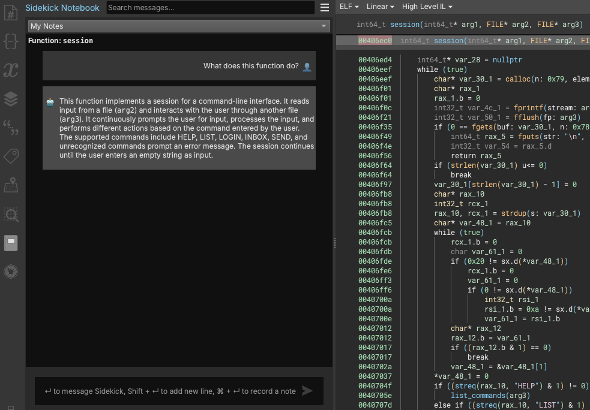

Navigate to another function and ask a question about that function

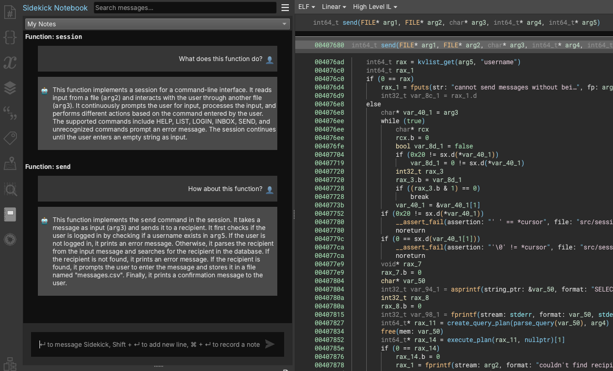

Add a private note to the page that does not get sent to the Sidekick assistant

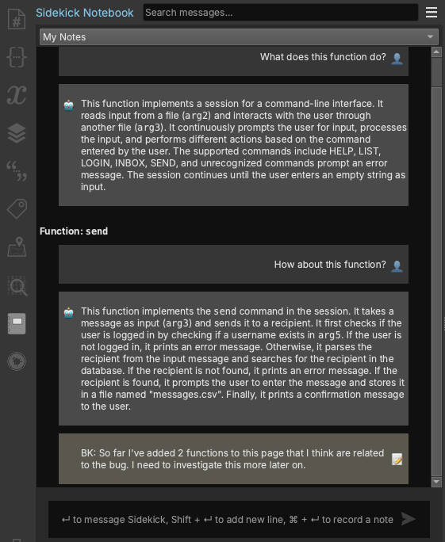

For a complete description of Sidekick's features, see the [User's Guide](guide/guide.md).

