# Getting Started

Welcome to Binary Ninja Sidekick. This document will get you up and running and show you the main features of the Sidekick plugin. For more detailed information, check out the [User's Guide](guide/intro.md).

## Purchase a Sidekick Plan

Most features of the Sidekick plugin are powered by the Sidekick service, which requires an active plan to access. Click [here](https://sidekick.binary.ninja/plans) to purchase a plan that best fits your needs.

!!! note

    When purchasing a plan, you will need to sign in to your Sidekick account. If you do not have a Sidekick account, you will be prompted to create one, or you can create one [here](https://sidekick.binary.ninja/sign_in).

## Sidekick Plugin Installation

The installation process is straightforward and takes only a few minutes.  You can install the Sidekick plugin using the Plugin Manager.

!!! note

    The plugin has been well tested using the version of Python packaged with Binary Ninja, which is currently Python 3.10. By default, Binary Ninja will install the plugin using this version of Python, except for Linux users, which defaults to the latest version available on the system. For Linux users, we recommend configuring Binary Ninja to use Python 3.10. If you decide to configure Binary Ninja to use a separate Python virtual environment, see [Setting Up a Virtual Environment](environment.md).

### Installing the Plugin

Installing the Sidekick plugin is easy.  Launch the Plugin Manager by selecting `Plugins -> Manage Plugins` from the main menu. From the Plugin Manager search for "Sidekick" and locate the Sidekick plugin.  Then click the `Install` button.

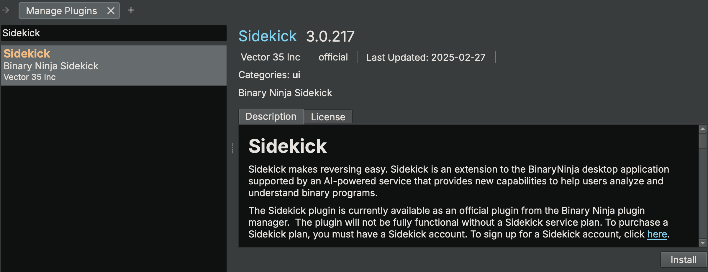

!!! note

    The Sidekick plugin has several package dependencies that may take a few minutes to install. Restart Binary Ninja after installation of the plugin is complete.

### Updating the Plugin

#### Binary Ninja 4.2.5814 and Later

If an update for the installed Sidekick plugin is available, then choose one of the following methods for updating the Sidekick plugin:

* Plugin Manager: Launch the Plugin Manager by selecting `Plugins -> Manage Plugins` from the main menu. From the Plugin Manager search for "Sidekick" and locate the Sidekick plugin. If an update is available, then click the `Update` button.

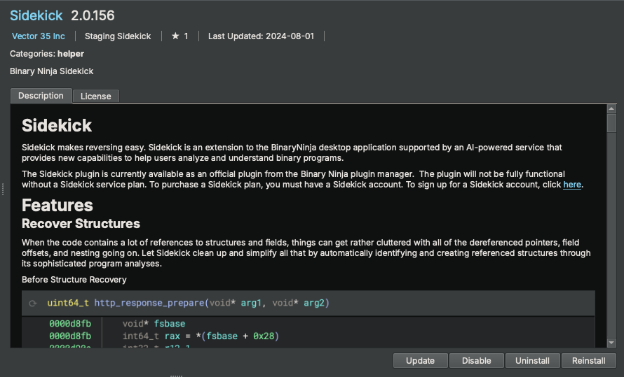

* Automatic Notification: On plugin startup, Sidekick automatically checks for updates. If one is available, then Sidekick asks you if you want to install it. Click `Yes`. Once the update is complete, then you will need to restart Binary Ninja.

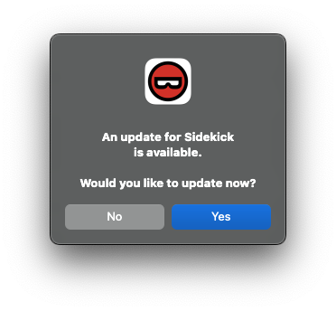

#### Before Binary Ninja 4.2.5814

If an update is available, then complete the following steps to update the plugin:

* Launch the Plugin Manager
* Locate the Sidekick plugin
* Click `Uninstall`
* Restart Binary Ninja
* Launch the Plugin Manager
* Locate the Sidekick plugin
* Click `Install`

### Configuring the Plugin

#### Set the API Key

To set your Sidekick API Key:

* Open the Settings tab within Binary Ninja from the `Binary Ninja -> Preferences->Settings` menu
* Search for `sidekick.api_key`
* Copy one of your API keys from your Sidekick account to the `Sidekick API Key` setting

!!! note
    You can find the API keys in your Sidekick account [here](https://sidekick.binary.ninja/account#api-keys)

Alternatively, the first time you launch the Sidekick plugin, you will be prompted to enter your Sidekick API key. If you provide an API key at this point, then it will get saved to your Settings.

## Quick Start

### Connecting to the Sidekick Service

The plugin will connect to the Sidekick service using the API key value in the `sidekick.api_key` setting.  If an API key is not provided, then you will not be able to access the Sidekick service.

!!! note
    All Sidekick features that do not rely on access to the Sidekick service are available to use for free. Refer [here](guide/intro.md#sidekick-service) for more information on which features require access to the Sidekick service.

### Sidekick Service Connection

You can configure the Sidekick plugin to connect to/disconnect from the Sidekick service. To switch the Sidekick plugin between the connected (online) and disconnected (offline) status, click the Sidekick status in the status bar at the bottom of the Binary Ninja window and select Connect/Disconnect.

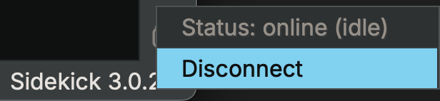

### Basic Usage

#### **Analysis Console**

The `Analysis Console` sidebar provides a chat interface to interact with the Sidekick `Analysis Assistant` for a given scope of functions. These conversations are stored for easy reference.

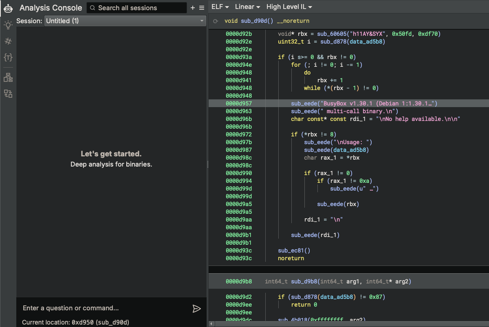

Ask a question about the current function

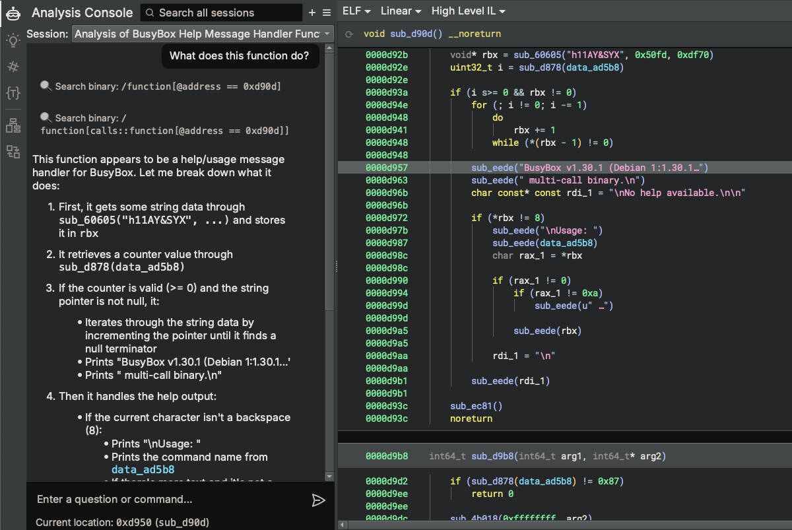

Navigate to another function and ask a question about that function

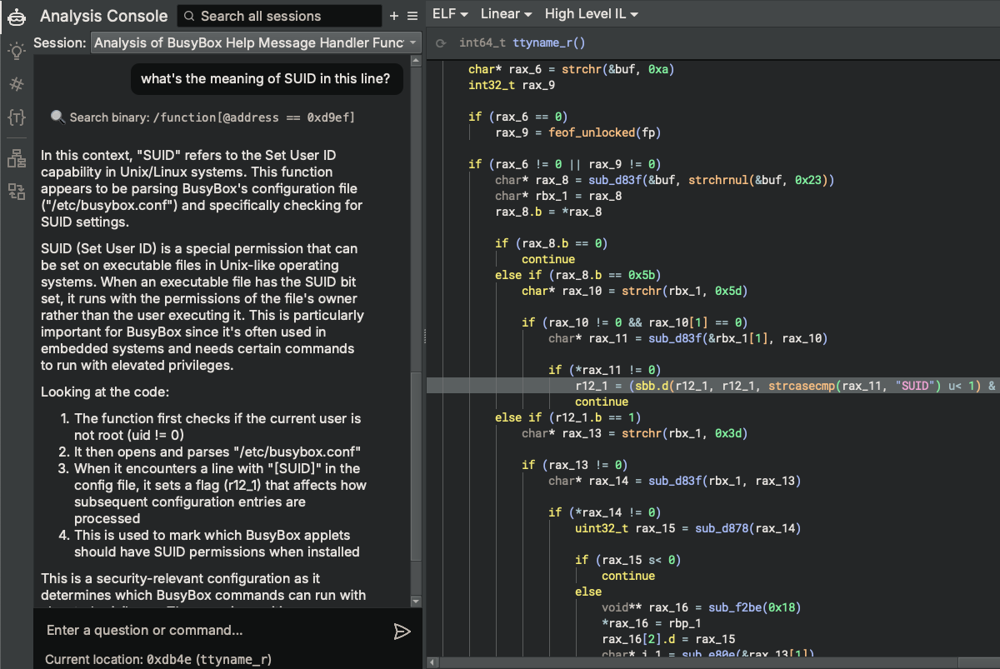

#### **Analysis Indexes**

The `Analysis Indexes` sidebar manages collections of items generated through analysis of the binary. Each collection (referred to as an "index") contains a table of items in the binary (e.g. functions, instructions, strings, etc.). By default, when opening a binary for the first time, the `Analyisis Indexes` sidebar does not contain any indexes. However, you can create new indexes, add entries to them, and view the entries in the table.

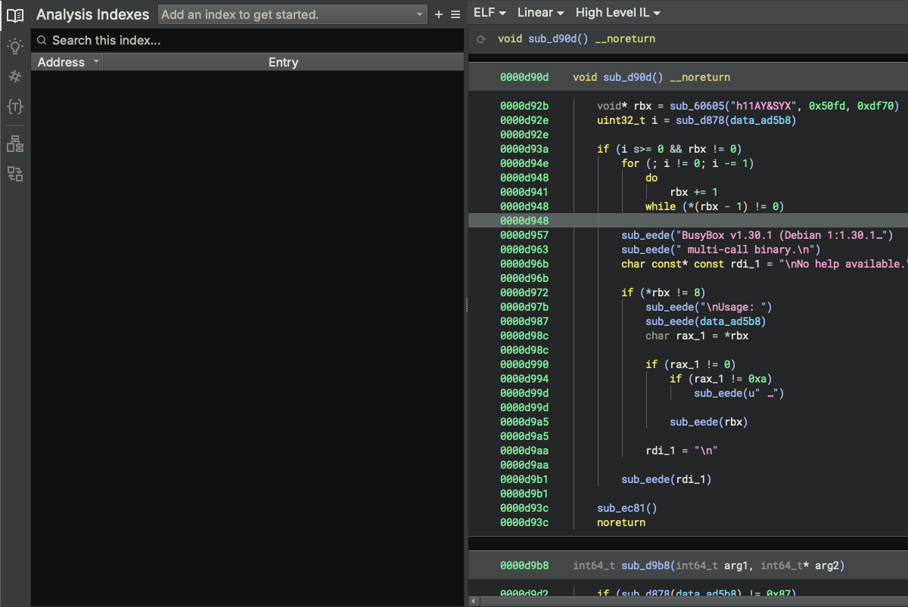

Try adding an index by running one of the example scripts from the `Automation Workbench` (e.g. High-Level Functions). To do this, open the `Automation Workbench` Sidebar, enter "High" in the search box, select the "High-Level Functions" script, and click `Run`. Once the script completes, open the `Analyisis Indexes` sidebar, select "High-Level Functions" from the indexes drop-down combobox, and view the entries in the table.

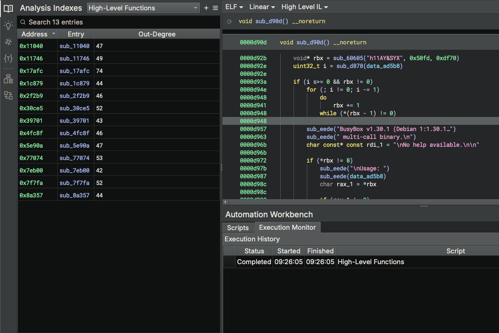

!!! note

    Sidekick legacy indexer scripts (from Sidekick 1.x) can been converted to scripts in the Automation Workbench. Any legacy indexer scripts stored in a user's Binary Ninja Database (BNDB) or User Directory can be converted by selecting the appropriate `Import Indexer Scripts` action from the Sidekick Plugin main menu.

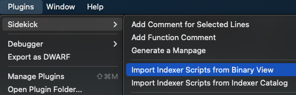

#### **Code Insight Map**

The `Code Insight Map` is a Binary Ninja view that enables you to visualize the calling relationships between items in `Analysis Indexes` using a customizable call-oriented graph. This view allows you to quickly obtain a top-level understanding of program behaviors by visualizing the calling relationships between functions and their focused content.

Select the `Code Insight Map` view from the View drop-down menu

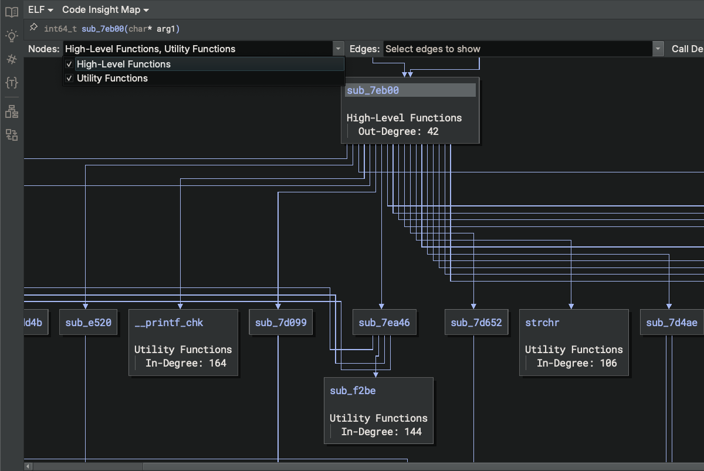

Enable/disable displayed topics

Adjust Call Depth sliders to expand/collapse the call graph context of the given function

#### **Automation Workbench**

The `Automation Workbench` sidebar provides an interface for creating, modifying, and running scripts that blend both the capabilities of Python code and large language models (LLMs) to automate repeated tasks.

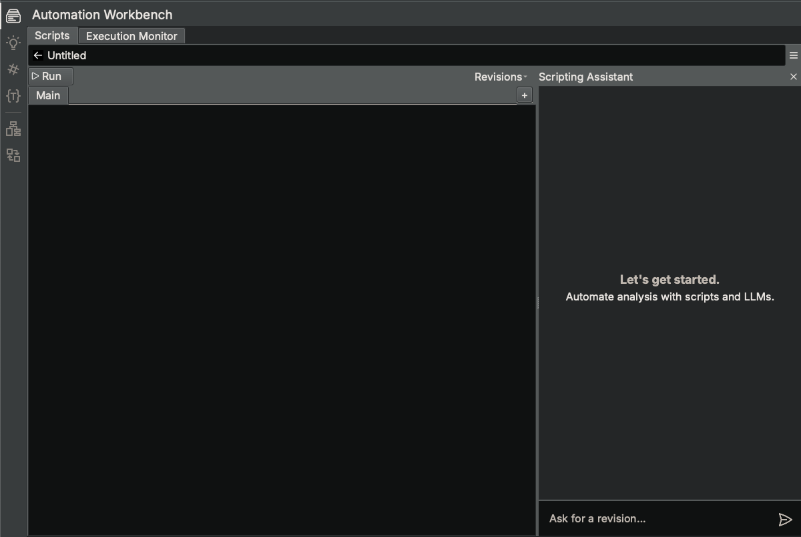

Try running the existing example script named "High-Level Functions". Search for it in the Scripts tab when in Search Mode and click `Run`. This particular script outputs results to an Index named "High-Level Functions", which can be viewed in the `Analyisis Indexes` sidebar.

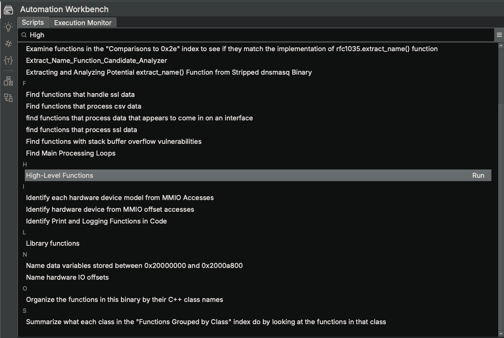

Try describing a new automation task and pressing `Enter`, which will open a new script editor. Sidekick will generate an initial version of the script based on your analysis task description and open the `Scripting Assistant` that works with you to refine your script.

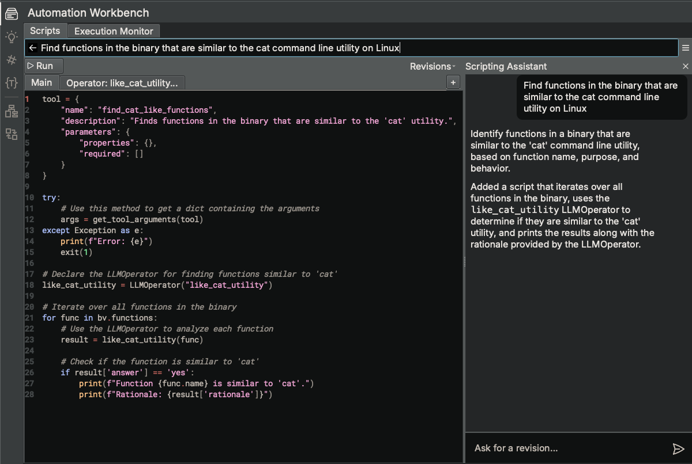

(Note: In this example, the script uses the `LLMOperator` class to perform a given task using an LLM based on an initial prompt and an input Binary Ninja object (e.g. `Function`).)

Once you are satisfied with the script, try running it by clicking `Run`.

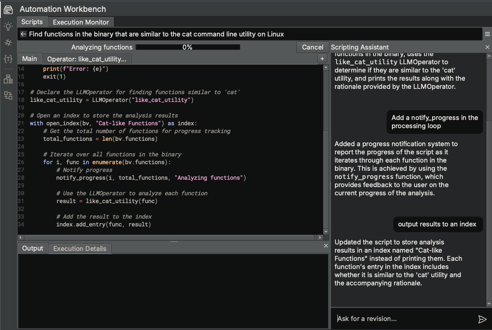

Provide us with feedback on how things went by selecting `Submit Feedback...` from the hamburger menu.

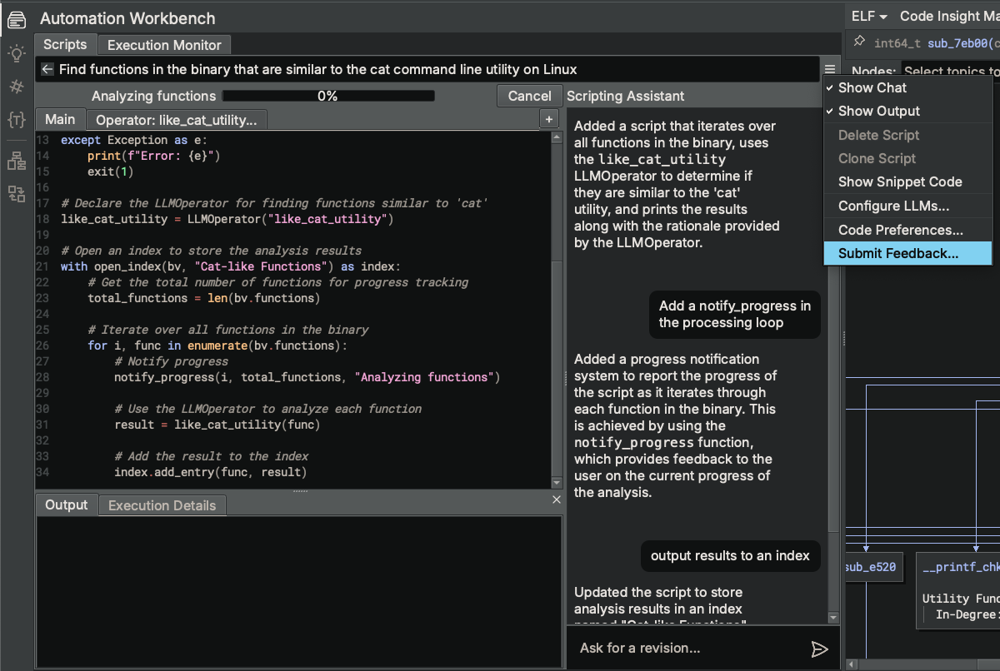
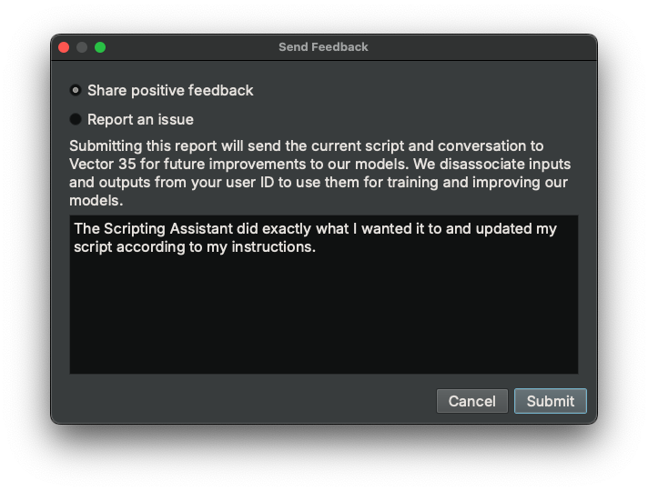

!!! note

    Feedback is only collected for non-commercial plans or commercial-plan users that have opted-in for data collection.

#### **Decompilation Suggestions**

Use the `Decompilation Suggestions` sidebar to get suggestions for improving the clarity of the current function.

Request Sidekick to make suggestions for you, or choose specific suggestions types yourself

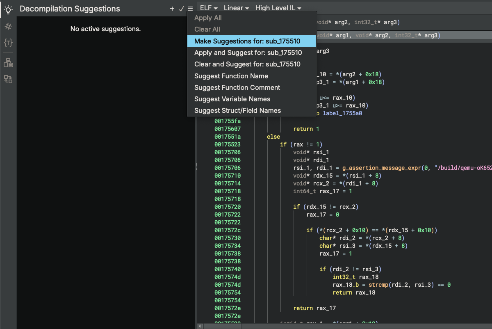

Review suggestions and accept the ones you want to apply

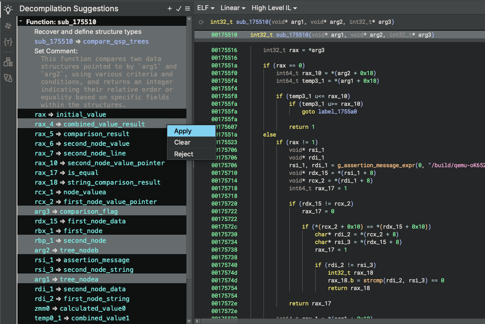
