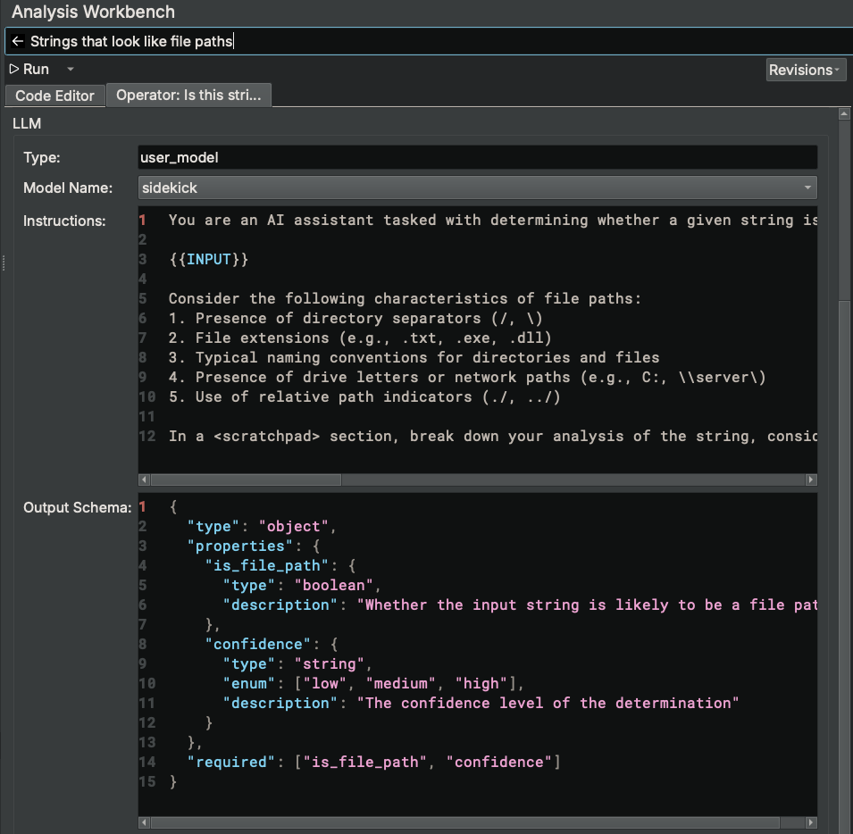

# Analysis Workbench

The Analysis Workbench is a feature that allows users to create, refine, and run scripts that blend both Python code and the capabilities of large language models to perform complex analysis tasks.

## Concepts

### Scripts

At the most fundamental level, a script in the Analysis Workbench is Python code. The script executes within an environment that has built-in access to both the Binary Ninja Python API and a set of Sidekick Python APIs for executing LLMOperators, interacting with the Sidekick indexes, and displaying progress. Since scripts are just Python code, you can do anything with them that you can with Python, provided you import and install the necessasary dependencies into your Python environment. Since scripts have access to the full Binary Ninja Python API, anything you can do within Binary Ninja using the Python API, you can do with a script (including modifying the binary). Lastly, scripts support the execution of LLM Operators (see below) that incorporate the capabilities of large language models.

### LLM Operators

You can think of an LLM operator as a function that is configured to have a large language model respond to a user's prompt or request. That function can then operate on  an input Binary Ninja object type (e.g. Function, Variable, String, Call Site, Instruction, etc). For example, if I wanted to ask a large language model if a given Binary Ninja Function accesses encrypted strings, then I would first instantiate an LLMOperator with the relevant prompt and pass the given function to it to analyze as follows:

```
references_strings = LLMOperator("Does this function reference encrypted strings?")

for func in bv.functions:
    result = references_strings(func)
```

In this example, `references_strings` is an LLMOperator instance that when called with an input Binary Ninja Function object will consult a large language model to determine if the given function references encrypted strings. LLM operators can prompt a large language model in a variety of ways (left as an exercise for the user). LLM operators are designed to accept most if not all Binary Ninja object types and capture the appropriate context needed based on the type of object passed. The format of the results returned from the LLM operator depends on how the script accesses the information in them, which Sidekick infers automatically and builds the necessary specification for during script generation and LLMOperator construction.

### LLM Operator Models

Since each LLM operator consults a large language model for its analysis, a model must be configured and enabled for it to use. Sidekick supports several models for LLM operators and provides an interface to configure and enable them through the [LLMOperator Model Catalog](llmoperator_model_catalog.md) Sidebar.

## Search/Execution Mode

When first opening the Analysis Workbench Sidebar, the Search/Execution Mode is displayed. This mode provides the ability to find and execute existing scripts and manage their execution.

### Sorting Scripts

Existing scripts are stored in a local database and displayed within this mode. The list of available scripts can be sorted by title (alphabetically), by last modified, or by last executed. Select which sort option you would like from the hamburger menu.

### Searching Scripts

To search for an existing script, enter a search term for the script you are looking for in the search text box. The script list will filter results based on your search term.

Additionally, you can scroll down to view all scripts.

!!! note

    When new scripts are added or imported into the script database, the list of scripts may not automatically update. One method for updating them is to enter any search term and then clear the search box.

### Executing Scripts

To execute an existing script, select one of the existing scripts from the list and perform one of the following actions:

* Press `Cmd + Enter` (on MacOS) or `Cntrl + Enter` (on Windows/Linux)
* Press the `Run` button next to the selected script title
* Right-click the selected script title and select `Run Script`

!!! note

    Scripts are executed sequentially from a queue as they are selected for execution by the user. Consequently, the user can queue up a script for execution while another is currently executing.

### Editing Scripts

To edit an existing script, perform one of the following actions:

* Double-click an existing script
* Select an existing script and press `Enter`
* Select an existing script, right-click its title and select `Edit Script`
* Select an existing script and press `Cmd + ]` (on MacOS) or `Cntrl + ]` (on Windows/Linux)

### Deleting Scripts

To delete an existing script, select an existing script, right-click its title and select `Delete Script`

### Viewing Script Execution History

The execution history for scripts can be displayed/hidden by enabling/disabling the `Show Execution History` option from the hamburger menu. When enabled, the `Execution History` table is displayed with entries containing details for each script execution.

### Canceling Script Execution

While a script is executing, an entry for its execution is placed in the `Execution History` table. To cancel a script while it is executing, right-click its execution entry in the `Execution History` table and select `Cancel Execution`.

### Clear Execution History

To clear the execution history, right click the `Execution History` table and select `Clear History`.

### Generating New Analysis Task

If none of the existing scripts perforom the task you want, then you may generate a new analysis task by entering a description of the analysis task you want Sidekick to peform in the search text box and press `Enter`. This action will do the following:

* Switches the mode to Edit Mode
* Creates a new script with a title set to the description of the analysis task
* Enters the analysis task description into the Sidekick Coding Assistant message history
* Prompts the Sidekick Coding Assistant to generate script code that accomplishes the described analysis task

### Creating New Script

To create a new empty script, click the hamburger menu and select `New Script`

### Setting Code Preferences

For the scripts that the Sidekick Coding Assistant generates, you can specify coding preferences for it to follow. To do this, click the hamburger menu and select `Code Preferences...`. In the `Code Writing Preferences` dialog window that opens, enter instructions that capture the preferences you want and click `Save`. For example, you may want to always have results output to an index or the console. 

## Edit Mode

Edit Mode provides the ability to write, refine, build, and run a script and view its output. This mode provides the following UI elements:

* Main editor widget containing a tab for the Code Editor and a tab for the LLM Operator (if included)
* Sidekick Coding Assistant widget for interactions with the Sidekick Coding Assistant
* Output widget for displaying separate tabs for Output from an execution and Execution Details.

### Setting Script Title

To set the title of the script, enter the new title in the title text box.

### Editing Script Code

To edit the script code, enter text in the Code Editor.

### Viewing Revisions

As revisions of the code are made, each revision can be viewed by clicking the `Revisions` drop-down combobox and selecting a specific revision from the history. Each displayed revision includes the last time the revision was modified and the author of the revision (i.e. `assistant` or `user`). After selecting a specific revision, the Code Editor will update to show the version of the code from that revision.

### Saving Revisions

Revisions are automatically saved when one of the following occurs:

* Script is created
* The Sidekick Coding Assistant updates the code in response to a message from the user in the Sidekick Coding Assistant chat widget
* `Run` or `Build` action is selected from the `Run` drop-down combobox
* User switches to Search/Execution Mode

### Running Script Code

To run the current script code, perform one of the following actions:

* Click the `Run` button
* Click the drop-down combobox icon next to the `Run` button and select `Run`

During execution of the script code, output will be displayed in the Output tab of the Output widget.

### Building Script Code

When a script includes an LLMOperator, the specification for the LLMOperator must be built. This specification defines the following:

* Input variables needed by the LLM operation (e.g. required context such as surrounding code, data variables, strings, etc)
* Model type (e.g. user model)
* Model name of the model used by the LLMOperator (e.g. `sidekick`, `gpt-4o-mini`)
* Instructions to the model that have been contextualized for the given task description
* Output schema that describes the format of the results generated by the model

The specification is built automatically (if needed) as part of the main `Run` action. However, to run the build step manually, click the drop-down combo box icon next to the `Run` button and select `Build`.

Once the specification is built, it can be viewed in a separate tab that is created in the Code Editor pane for that LLMOperator named `Operator: <description>`.



### Editing LLM Operator

To edit an LLM Operator for a given LLMOperator that is built as part of a script, select the Operator tab containing the description of the LLMOperator. From this tab, you can modify any of the existing fields:

* Type
* Model Name
* Instructions
* Output Schema

!!! note
        Only models enabled in the LLMOperator Models Catalog will be available for selection in the `Model Name` field.

This interface allows a user to refine and/or customize an LLM Operator to suite the needs of their particular task.

### Cloning Scripts

To make a copy of the current script, click the hamburger menu and select `Clone Script`. This will copy the current script with a new title and set the Edit Mode to the new script.

### Deleting Edited Scripts

To delete the current script, click the hamburger menu and select `Delete Script`. This action will delete the script and switch the mode to Search/Execution Mode.

### Showing Snippet Code

To show the snippet code for the current script, click the hamburger menu and select `Show Snippet Code`. This will open a dialog window that contains the code necessary to run the current script from a code snippet, which includes the UUID of the script. This feature allows a user to run the script programmatically using the API.

### Viewing Output

To view/hide the output of a script execution, click the hamburger menu and select/deselect `Show Output`. This action will open/close the Output widget that includes the Output tab.

The Output tab captures content printed to the console by the script during execution.

### Viewing Execution Details

To view/hide the Execution Details of a script execution, click the hamburger menu and select/deselect `Show Output`. This action will open/close the Output widget that includes the Execution Details tab. Click the Execution Details tab to view the details of a completed script execution.

### Submitting Feedback

To submit feedback on how the Analysis Workbench did in accomplishing your task, click the hamburger menu and select `Submit Feedback...`. This will open a Feedback dialog window. Select whether or not the script accomplished your task and provide details on what worked or didn't work. Click `Submit` when finished.

### Interacting with the Sidekick Coding Assistant

The Sidekick Coding Assistant widget provides a chat-like interface for you to refine your script by describing to Sidekick what you want. Enter your request in the Message box and press `Enter` or click the `Send a message` button.

For each message in the chat history, a revision of the code at that point in time is captured. To view one of these revisions, click on a message in the chat history. This will update the Code Editor to display the revision of the code associated with that message.

To show/hide the Sidekick Coding Assistant widget, click the hamburger menu and select/deselect `Show Chat`.

### Handling Script Errors

Sometimes the generated script will encounter errors during execution, which are displayed in the Output. The Sidekick Coding Assistant has access to this Output to help refine the script and resolve errors, but it needs to know about them. When this happens, send a message to the Sidekick Coding Assistant to let it know about the error (e.g. "An error occurred" or "Please fix that error").

## Switching Modes

There are a few options for switching between Search/Execution Mode and Edit Mode.

To switch from Search/Execution Mode to Edit Mode, perform one of the following sets of actions:

* Edit an existing script
* Create a new script
* Generate a new analysis task

To switch from Edit Mode to Search/Execution Mode, perform one of the following sets of actions:

* Click the left-arrow icon next to the script Title (when the script is not building/running)
* Press `Cmd + [` (on MacOS) or `Cntrl + [` (on Windows/Linux)