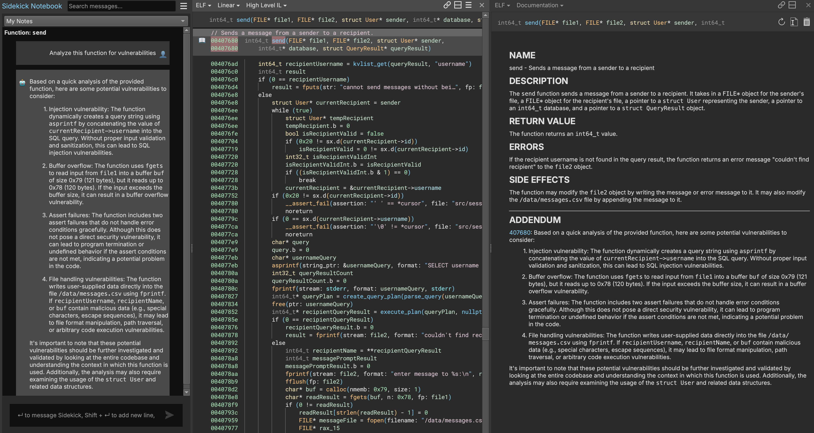

# Documentation View

Documentation View provides a description of the current function very much in the style of a traditional man page. Sidekick automatically generates documentation based on the code in the current function and includes sections for NAME, DESCRIPTION, RETURN VALUE, ERRORS, and SIDE EFFECTS. Users can edit this content and also append supplemental information through a separate ADDENDUM section.
## Generating Documentation

Within the Documentation view, click the `Regenerate Documentation` button to request Sidekick to re-generate documentation. This operation will overwrite any existing documentation.  If you wish to keep any existing documentation, then you have a couple of options:

1. Copy the content you want to keep to another location and insert it back into the documentation after regeneration is complete (using the `Edit Documentation` mode).
2. Copy the content to the `ADDENDUM` section of the documentation, which is not overwritten when regenerating documentation. To add the `ADDENDUM` section to the documentation if it is not already present, append the following to the documentation (in `Edit Documentation` mode):

```
<!-- Addendum - NO NOT REMOVE THIS LINE -->
---
## ADDENDUM
```

Documentation is automatically saved within the BNDB as a Binary Ninja tag. A Documentation tag icon appears next to each function that contains documentation within the Linear and Graph views. All functions with documentation can be easily referenced from the `Tags` Sidebar by searching for tags with the Documentation tag type.

An alternative method for generating documentation for a function that does not currently have documentation is to select `Generate a Manpage` from the `Plugins->Sidekick` menu.

## Editing Documentation
Documentation for a selected function is editable using Markdown. To edit the documentation, click the `Edit Documentation` button.

(Note: Users can generate their own documentation through the `Edit Documentation` action.)

## Delete Documentation
To delete documentation for the current function, click the `Delete Documentation` button. This operation deletes all content from the documentation (including the `ADDENDUM` section) and also removes the Documentation tag from the current function.

## Integration with the Sidekick Notebook
Users can append messages from a Sidekick Notebook page to the documentation for the function linked to that message by right-clicking a message and selecting `Append to Documentation`. This operation creates the `ADDENDUM` section if not already present in the documentation, appends the message to the `ADDENDUM` section, and includes an address link to the location in the function for that message.


## Tips on Using the Documentation View

1. Due to the [Integration with the Notebook](./documentation.md#integration-with-the-sidekick-notebook), one potentially helpful workflow is to open the Notebook Sidebar and split the view to display both the code (e.g. Linear or Graph View) and the Documentation View.  Within this layout, as you get responses from the Sidekick assistant on topic-focused questions, you can quickly append them to and visually reference them within the Documentation View.




