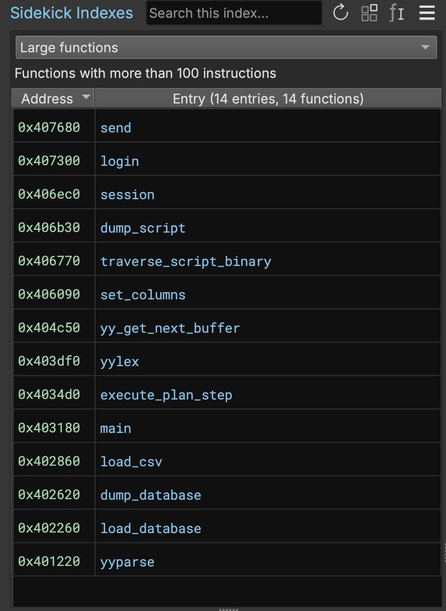
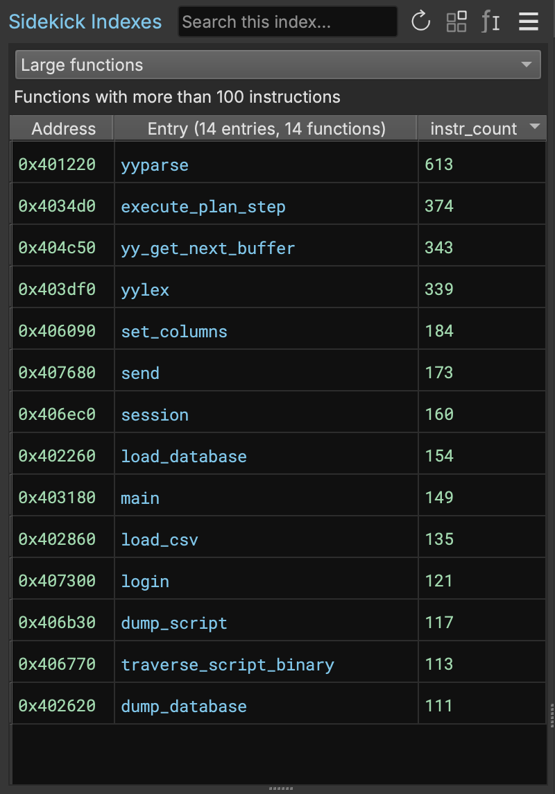

# Indexes (Sidekick Version 1.x)

An index is a list of locations in the binary related to a specific topic that help you quickly find what you're looking for.
A topic refers to an interesting feature or property of an item in the binary, such as:

* Functions that perform file or network I/O
* Functions that parse data
* Strings that contain file paths or URLs
* Strings that contain cryptographic keys
* Components that contain functions that perform cryptographic operations
* Instructions that allocate memory without checking for errors
* And so on...

Each binary that you open has its own set of indexes, each related to a pre-defined or user-defined topic.

The indexing process works by running a Python indexer script that is specific to a given topic. The script uses the Binary Ninja API to find entries that match the topic. Entries can be components, functions, instructions, variables, or strings.

Indexer scripts are run in the background. An indexer script is executed when you first add the index to the Sidekick Indexes, or when you select the `Refresh Index` button in the Sidekick Indexes sidebar.
You can cancel the indexing process by clicking the `Cancel` button next to the indexing progress indicator.

Click [here](./indexes.md#how-to-write-an-indexer-script) for examples of how to write an indexer script.

## Indexes Sidebar

The Indexes Sidebar is the place for viewing and managing the Indexes.  To access the Indexes sidebar, simply click the Sidekick Indexes icon.

### Selecting the Current Index

To select the current index to display, use the combo box at the top of the sidebar, which contains the set of indexes added to the current binary.

Once an index is selected, entries matching the topic for the selected index are displayed in a table within the sidebar. Clicking on an entry in the table navigates you to the location in the binary associated with the entry address.

### Searching for Entries In the Current Index

To search for entries in the table for the current index, enter a search term in the `Search this index...` text box at the top of the sidebar. Only table entries containing matches to the current search term are displayed

### Re-running the Current Index

To re-run the indexer script for the current index, click on the `Refresh Index` button at the top of the sidebar. The indexer script for this index is executed in the background and when complete, the table is updated with entries matching the topic for the current index. When hovering over this button, the time that the indexer script was last run is displayed.

### Creating Components for the Current Index

To create components for the set of functions containing entries in the table for the current index, click on the `Create components for functions in this index` button. This operation may take a while depending on the number of functions in the current index.  While the operation is in progress, status is displayed in the status bar on the lower left corner. The operation can be canceled by clicking on the X on the status bar. Any components created prior to canceling are kept.

### Naming Functions for the Current Index

To apply names to the set of unnamed functions associated with entries in the table for the current index, perform any of the following actions:

- Click on the `Name the functions in this index` button in the Sidekick Indexers sidebar
- Select `Name Functions in Current Index` from the `Plugins->Sidekick` menu

This operation may take a while depending on the number of functions in the current index.  While the operation is in progress, status is displayed in the status bar on the lower left corner. The operation can be canceled by clicking on the X on the status bar. Any names applied prior to canceling are kept.

The process for naming functions in the current index first generates names for all unnamed callee functions using the method described [here](./function_callee_naming.md). Once all callees for the current function have been named, then Sidekick generates a name for that function.

### Adding an Index

To add an index to the set of indexes for the current binary, click on the hamburger menu and select `Add Indexes`. This will open the `Add Indexes` dialog containing a list of available indexes to add. This list can be searched by typing keywords, phrases, or script names in the search text box at the top of the dialog window. Select each index you want to add to the set of the indexes for the current binary by clicking on the index name. This will toggle the check-box for that index. Click the `Add Indexes` button to add the checked indexes.

Sidekick comes with a set of pre-defined indexes that can be added to the set of indexes for the current binary. These indexes are indicated by an external URI (e.g. `https://`) in the `Provider` field of the index description on the `Add Indexes` dialog window. Users can also create their own local indexes, which are indicated by a `file://` URI in the `Provider` field of index description.

### Creating an Index

To create a new index, from the `Add Indexes` dialog, click the `Create` button. This will open the `Create New Indexer` dialog, which lets you define a new index by specifying a name, description, and indexer script.

You can manually write the indexer script within the `Script` text box or use the `Generate` button to automatically generate a script based on the content in the `Description` text box. For details on how to write your own indexer script, click [here](./indexes.md#how-to-write-an-indexer-script).


Once you are finished, click the `Accept` button to add the new index to the list of available indexes.

(Note: User-created indexes are stored in an index repository within the Binary Ninja User Directory and available across binaries and Binary Ninja application sessions.)

### Auto-Generating Indexer Scripts

The `Generate` button in the `Create New Indexer` dialog automatically generates a script based on the description.
The script is generated using a LLM (Large Language Model).  We are constantly improving the LLM to generate better scripts.
You can use the generated script as a starting point for your own script.

### Editing Indexes

To edit an index, open the Edit Topic dialog using any of the following methods:

- From the `Add Indexes` dialog, select an index and click the `Edit` button. (Note: This only applies to local indexes.)
- From the Sidekick Indexes sidebar, select an index from the set of indexes for the current binary in the combo box and select `Edit Index` from the hamburger menu

This will open the `Edit Topic` dialog, which lets you modify the name, description, and indexer script for the index. You can also auto-generate a new indexer script by clicking the `Generate` button, which will overwrite the existing indexer script.

Once you are finished making edits, click on the `Accept` button to apply edits to the index.

### Making a Local Copy of Remote Indexes

As mentioned above, Sidekick comes with a set of pre-defined indexes that are stored in a remote repository. Remote indexes are indicated by an external URI (e.g. `https://`) in the `Provider` field of the index description. These indexes can be edited; however, in order to edit them, they must first be copied to the local repository. To make a local copy of a remote index, from within the `Add Indexes` dialog, right-click on a remote index and click `Make a Local Copy`. This opens a warning box indicating that you will be editing a local copy of the index followed by opening an `Edit Topic` dialog for the local copy of the index. From this dialog, the local copy can be edited prior to clicking on the `Accept` button. After accepting, the local copy will appear in the list of available indexes in the `Add Indexes` dialog. The local copy of the index will have a `file://` URI in the `Provider`  field of its description.

### Removing Indexes

To remove an index from the set of indexes for the current binary, from the Sidekick Indexes sidebar, select an index from the set of indexes for the current binary in the combo box and select `Remove Index` from the hamburger menu

### Deleting Indexes

To delete an index from the local repository, from the `Add Indexes` dialog, select a local index (indicated with a `file://` URI in the `Provider` field of the index description), right-click and select `Delete`. (Note: This operation can only be performed on local indexes.)

### Navigating to Index Table Entry

To navigate to the location of an entry in the table for the current index, double-click on the entry or right-click and select `Navigate to item`

### Removing Entry from Index Table

To remove an entry from the table for the current index, right-click on the entry and select `Remove from index`

### Saving an Indexing Suite

Sidekick provides the ability to save indexes that are in the set of indexes for the current binary as a named collection (called an Indexing Suite) that can later be loaded into the set of indexes for another binary. To save indexes to an Index Suite, perform the following steps:

- From the Sidekick Indexes sidebar, click on the hamburger menu and select `Save Indexing Suite As...`
- In the `Save Indexing Suite` dialog, select the indexes you want to save in the suite
- Enter a name for the indexing suite in the `Save As` field
- Click `Save`

!!! note

    Selecting the name of an existing Indexing Suite will over-write that Indexing Suite with the selected indexes.

### Loading an Indexing Suite

Sidekick provides the ability to load the indexes defined in an Indexing Suite to the set of indexes for the current binary. To load an Indexing Suite, perform the following steps:

- From the Sidekick Indexes sidebar, click on the hamburger menu and select `Load Indexing Suite...`
- In the `Load Indexing Suite` dialog, from the `Suite:` column, select the Indexing Suite you want to load
- In the `Indexers:` column, select the set of indexes you want to load. By default, all indexes in the suite are selected.
- Click `Load`

!!! note

    During loading, the indexer script for each index selected will be run in the background and populate the items in the table for that index.


## How to Write an Indexer Script

The purpose of an indexer script is to return items in the binary that match what you are looking for. The first step to writing an indexer script is determining what it is that you want to find. When creating a new indexer script, Sidekick provides the following default template:

```
from binaryninja import *
from Vector35_Sidekick.indexing import IndexedValue

def indexer(bv: BinaryView) -> Generator[IndexedValue, None, None]:
   """This function generates values for a Sidekick Index."""
   # TODO: Implement your indexer here, or use the Generate button to write
   #       the code based on the description above.
   yield from bv.functions
```

From this template, you can implement the logic that finds matching items in the binary. You have flexibility in the types of items that you can find, which can be any of the following types defined by `IndexedValue`:

- Component
- Function
- StringReference
- Variable
- HighLevelILInstruction
- MediumLevelILInstruction
- LowLevelILInstruction

For example, the following sample indexer script finds all functions that contain more than 100 instructions:

```
from binaryninja import *
from Vector35_Sidekick.indexing import IndexedValue

def indexer(bv: BinaryView):
  for func in bv.functions:
    instr_count = len(list(func.instructions))
    if instr_count > 100:
      yield func
```

As the indexer script finds matching items, Sidekick will add them as entries in the index table, showing both the address of the item location and the item itself.



Note: A single indexer script can yield more than one item type. This allows users to index a variety of types of items in the binary using a single script.

### Returning Metadata in an Indexer Script

Sidekick also supports the ability for indexer scripts to return metadata with an item. Metadata are stored as a dictionary of key-value pairs. To provide metadata in your script, return the item and metadata dictionary as a tuple `(item, metadata)`. For example, we can extend the sample indexer script above to also return the number of instructions as a metadata item:

```
from binaryninja import *
from Vector35_Sidekick.indexing import IndexedValue

def indexer(bv: BinaryView):
  for func in bv.functions:
    instr_count = len(list(func.instructions))
    metadata = {'instr_count': instr_count}
    if instr_count > 100:
      yield (func, metadata)
```

When metadata are returned by the script, Sidekick will include additional columns in the index table, one for each key in the metadata.  The column header is set to the metadata key name, and the value in that column for that entry is the value from the metadata key-value pair.



Note: Entries in the index table can be sorted by metadata columns, which provides flexibility to the user to sort based on the desired metadata key.
