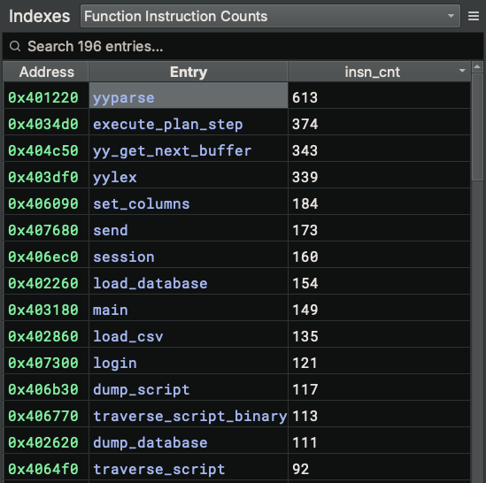

# Indexes (Sidekick Version 2.x)

An index is a collection of related items in the binary that you can navigate to, which is similar to the concept of an index in the back of a book that contains page numbers for various topics. The primary purpose of indexes is for reference.

Indexes are populated by Analysis Workbench scripts that use the Sidekick API to create an index and add entries. An entry can be any Binary Ninja object that you can navigate to via address  (e.g. Function, Instruction, DataVariable, StringReference, etc). Indexes are primarily used to group related items together; however, since they are simply collections of items, they do not have to be related. Also, multiple scripts can add entries to the same index.

## Indexes Sidebar

The Indexes Sidebar is the place for viewing and managing indexes.  To access the Indexes sidebar, simply click the Sidekick Indexes icon.

### Selecting the Current Index

To select the current index to display, use the combo box at the top of the sidebar, which contains the set of indexes added to the current binary.

Once an index is selected, its entries are displayed in a table within the sidebar. Clicking on an entry in the table navigates to the location in the binary associated with the entry address.

### Searching for Entries In the Current Index

To search for entries in the table for the current index, enter a search term in the `Search [n] entries...` text box at the top of the sidebar. Only table entries containing matches to the current search term are displayed.

!!! note

    All columns in the index table are searchable.

### Removing Indexes

To remove an index from the set of indexes for the current binary, select the index that you want to remove from the indexes set using the combo box, click the hamburger menu, and select `Remove Index`.

### Navigating to Entry Address

To navigate to the location in the binary associated with an index table entry, perform any of the following actions:

* Double-click on the `Address` or `Entry` column value for a given index table entry
* Right-click on the index table entry and select `Navigate to Address`

### Marking Entry Read Only

Index table entries can be marked read-only, which prevents them from being over-written when the table is updated during script execution. To mark/de-mark an entry read-only, right-click on the index table entry and select/deselect `Read Only`.

!!! note

    If an entry is marked as read-only, then when the same script that originally generated the entry is re-run and adds the same entry, a new, duplicate entry will be added to the table. If the read-only attribute of the entry is removed, then when the same script that originally generated the entry is re-run, any duplicate non-read-only entries will be removed.

### Copying Cells

To copy cells to the clipboard, select any set of cells, right-click and select `Copy`.

### Removing Entries

To remove entries from the index table, select any cell of the entries you want to remove, right-click and select `Remove Rows`. Multiple selections are supported.

!!! note

    Entries marked as read-only will not be removed.

### Re-running Source Scripts

Associated with each entry in an index is the source script that was used to add it. This allows entries in the index to be refreshed or updated based on the latest state of the binary and/or script. To re-run the source scripts associated with entries in an index, perform any of the following actions:

* Select an index from the indexes set, click the hamburger menu, and select `Re-run Source Scripts`
* Right-click anywhere on the index table and select `Re-run Source Scripts`

!!! note
    Index entries do not automatically refresh when associated updates to the binary or scripts occur. Re-running source scripts is the mechanism for updating entries.

### Showing Cell Preview

To show/hide a preview of a selected cell in the index table, click the hamburger menu and select/deselect `Show Cell Preview`. This action will open/close the Cell Contents pane within the Indexes sidebar.

!!! note
    Cells from the `Entry` column are not displayed in the call preview. Also, during an update to the index table, the cell contents preview is cleared. A cell must be selected again to preview its contents.

### Pinning Indexes

A single index can be opened in a separate pane within the main view frame through an operation referred to as "pinning". To pin an index, select the index from the indexes set and perform any of the following actions:

* Click the hamburger menu and select `Pin Index to New Pane`
* Right-click anywhere on the index table and select `Pin Index to New Pane`

This action creates a new pane within the main view frame with the content of the selected index. From the pinned index, you can perform any of the following actions:

* Search the pinned index entries
* Sort index entries by column value
* Any right-click context menu action supported in the index table (excluding `Pin Index to New Pane`)

## Index Entry Metadata

Each index table entry at a mininum includes a Binary Ninja object and its address, displayed as the `Entry` and `Address` table fields, respectively. When an entry is added to a given index using the `add_entry()` Sidekick API, the first parameter is a value whose type is a supported Binary Ninja object that can be navigated to via address. This method also accepts a second parameter `metadata` that is a dictionary object storing additional information that can be displayed in the index table as key-value pairs. Each key in the `metadata` object is the name of a column in the table, and its associated value is the value placed in the associated column for that index table entry row.

For example, the following script adds the instruction count for each function as metadata that gets displayed as a separate column `insn_cnt` in the index table shown below:

```
with open_index(bv, 'Function Instruction Counts') as index:
    for func in bv.functions:
        insn_cnt = len(list(func.instructions))
        index.add_entry(func, {"insn_cnt": insn_cnt})
```



!!! note
    Index table entries can be sorted by metadata columns.
