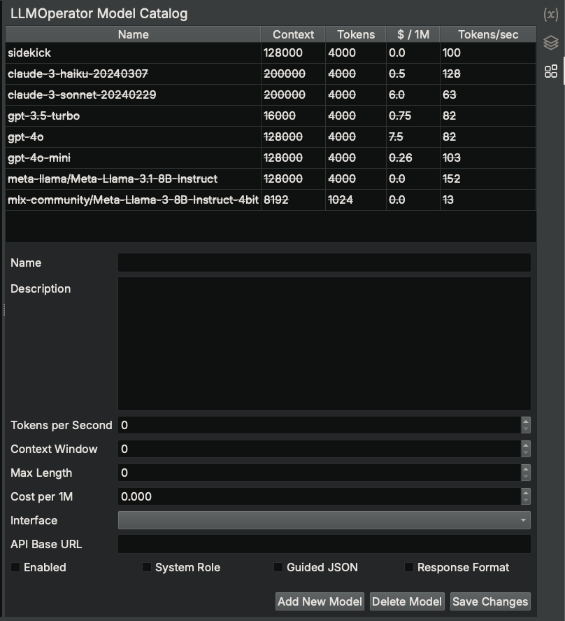

# LLMOperator Model Catalog

The LLMOperator Model Catalog sidebar provides a convenient interface for managing the models used by LLMOperators in Analysis Workbench scripts.

## Available Models

The Sidekick plugin includes a default model catalog if one is not already present in the user's Binary Ninja User Directory. The following models are defined in the default model catalog and serve as examples of how to configure models other than the default model:

### sidekick

(Enabled by default)

This model is the only model enabled by default. It is provided by the Sidekick service and requires an active Sidekick plan.

It offers advanced reasoning and contextual understanding capabilities. It is highly suitable for complex tasks in reverse engineering, vulnerability research, and malware analysis. This model excels in detailed code understanding, advanced control flow analysis, and sophisticated malware behavior analysis, making it an ideal choice for projects that require detailed insights and high precision.

### claude-3-haiku-20240307

(Disabled by default)

This model is provided by the Anthropic service through their API and requires the following:

* `anthropic` Python package must be installed in the Binary Ninja's Python site-packages
* User must provide their own Anthropic API key
* Launch Binary Ninja with the environment variable `ANTHROPIC_API_KEY` set to the user's Anthropic API key

Claude-3-haiku is a fast and efficient variant of the Claude 3 model, suitable for basic to intermediate tasks. It is ideal for safe and interpretable code analysis, initial vulnerability research, and basic malware analysis, focusing on ethical considerations. This model is perfect for projects that require quick results and clear, interpretable outcomes, especially when handling less complex analysis tasks.

### claude-3-sonnet-20240229

(Disabled by default)

This model is provided by the Anthropic service through their API and requires the following:

* `anthropic` Python package must be installed in the Binary Ninja's Python site-packages
* User must provide their own Anthropic API key
* Launch Binary Ninja with the environment variable `ANTHROPIC_API_KEY` set to the user's Anthropic API key

Claude-3-sonnet offers a balanced mix of speed and detailed analysis, making it suitable for intermediate tasks. It supports detailed vulnerability research, balanced code analysis, and comprehensive malware analysis with a focus on both efficiency and detail. This model is ideal for tasks that require a good balance between thorough analysis and processing speed, ensuring high-quality results without excessive computational cost.

### gpt-3.5-turbo

(Disabled by default)

This model is provided by the OpenAI service through their API and requires the following:

* `openai` Python package must be installed in the Binary Ninja's Python site-packages
* User must provide their own OpenAI API key
* Launch Binary Ninja with the environment variable `OPENAI_API_KEY` set to the user's OpenAI API key

GPT-3.5-turbo is a versatile model with strong natural language understanding, ideal for intermediate tasks in reverse engineering, vulnerability research, and malware analysis. It performs well in code analysis and function annotation, as well as the initial stages of vulnerability research and identifying common security issues. This model strikes a good balance between performance and cost, making it a solid choice for projects requiring detailed analysis without significant computational expense.

### gpt-4o

(Disabled by default)

This model is provided by the OpenAI service through their API and requires the following:

* `openai` Python package must be installed in the Binary Ninja's Python site-packages
* User must provide their own OpenAI API key
* Launch Binary Ninja with the environment variable `OPENAI_API_KEY` set to the user's OpenAI API key

GPT-4o offers advanced reasoning and contextual understanding, making it highly suitable for complex tasks in reverse engineering, vulnerability research, and malware analysis. It excels in detailed code understanding, advanced control flow analysis, and sophisticated malware behavior analysis. This model is ideal for projects that demand in-depth analysis and high accuracy, especially when dealing with intricate code structures and complex security issues.

### gpt-4o-mini

(Disabled by default)

This model is provided by the OpenAI service through their API and requires the following:

* `openai` Python package must be installed in the Binary Ninja's Python site-packages
* User must provide their own OpenAI API key
* Launch Binary Ninja with the environment variable `OPENAI_API_KEY` set to the user's OpenAI API key

GPT-4o-mini, a more accessible variant of GPT-4o, provides similar advanced reasoning and contextual understanding capabilities. It is highly suitable for complex tasks in reverse engineering, vulnerability research, and malware analysis. This model excels in detailed code understanding, advanced control flow analysis, and sophisticated malware behavior analysis. It is an ideal choice for projects requiring detailed insights and high precision while being more cost-effective than its larger counterpart.

### meta-llama/Meta-Llama-3.1-8B-Instruct (via OpenAI-compatible API server)

(Disabled by default)

This model is an open model that can be hosted on user-provided resources using an OpenAI-compatible API server such as [vLLM](https://github.com/vllm-project/vllm), which requires installing the `openai` python package. The user must configure the `API Base URL` field of this model in the LLMOperator Model Catalog to point to the OpenAI-compatible API server. Also, the `openai` Python package must be installed in the Binary Ninja's Python site-packages.

Meta-Llama-3.1-8B-Instruct is designed for basic to intermediate analysis tasks, with a focus on efficiency and practicality. It excels in control flow and function analysis, making it suitable for foundational code analysis and initial vulnerability research. This model is particularly useful for tasks that require reliable insights without deep contextual understanding, offering a cost-effective solution for everyday analysis needs.

### mlx-community/Meta-Llama-3-8B-Instruct-4bit

(Disabled by default)

This model is an open model that runs locally on a user's machine running on Apple Silicon. This model requires installing the `mlx-lm` Python package in the Binary Ninja's Python site-packages.

Meta-Llama-3-8B-Instruct-4bit is a variant of Meta-Llama-3-8B-Instruct that is optimized for efficiency and speed, suitable for basic to intermediate analysis tasks.

## Modifying Model

To modify an existing model in the catalog, select a model from the catalog table. This displays the configuration for that model. Apply edits to the desired fields and click `Save Changes`.

To enable/disable the model, select/deselect the `Enabled` checkbox and click `Save Changes`. Disabling a model will result in Sidekick excluding that model from being used for LLMOperators.

## Adding New Model

To add a new model to the catalog, click `Add New Model`. This operation adds an empty, default model to the catalog and displays its configuration for editing. After specifying the necessary fields, click `Save Changes`.

## Deleting Model

To delete a model from the catalog, select a model from the catalog table and click `Delete Model`.